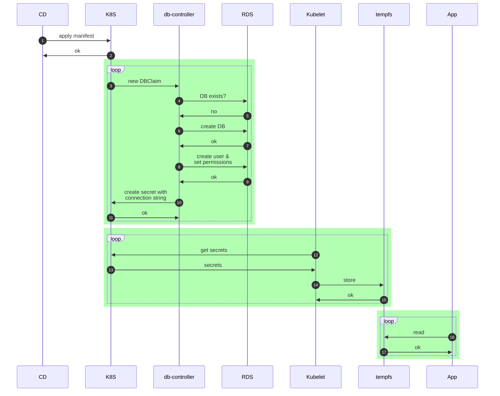
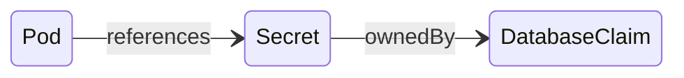

# Database Controller Docs

## Introduction
The motiviation for this project was to support dynamic creation of database resource
and minimal downtime of services during password rotation or DB instance migration.

This project implements a database controller. It introduces a CRD that allows
clients to create a database claim. That database claim will create a database in
an existing postgres server, or it could create a cloud claim that will attach a
database on demand. Additionally it will create user/password to the database and rotate them.
The database controller will also be used as a proxy driver for connecting to databases.

## Assumptions
***TBD***

## Operation
The Dynamic Database Connection Reconfiguration (DDCR) will consist of three 
components that will comprise the database claim pattern implemented by this project.  
The first will be a db-controller that is responsible for managing the connection 
information and associated database.  An application will create its intention 
to have a database by adding a  DatabaseClaim Custom Resource (DBClaim).
The second is a change to the service deployment that defines a Database Claim. 
This claim will provision a k8s secret that replaces the static credentials
created by deployment or dynamically retrieved from secret stores by
operators like [SpaceController](https://github.com/seizadi/space-controller).   
The third is a database driver that will be able to read the database connection
information from the secrets files in the pod volume and construct the 
connection string required for connecting through the real database driver.
The driver will also be able to detect when the connection information 
has changed and gracefully close any open database connections.  
The closing of the connections will effectively drain the connection 
pool as well as trigger a reconnect with the new connection string
information by the client service.

## Requirements
| Requirements           | Description                                                                                   |
|------------------------|-----------------------------------------------------------------------------------------------|
| DDCR                   | Establish a pattern (and possible code) for apps to reload connection information from a file |
| DDCR                   | Establish a pattern for mounting a secret that contains connection information in a secret    |
| DDCR                   | Support dynamically changing the connection information                                       |
| DDCR                   | Modify at least one Atlas app to show as an example of implementing this pattern              |
| Cloud Provider Tagging | Cloud Resource must be tagged so that then can following organization guidelines.             |

## Service Architecture
The first component is a db-controller service that will be responsible 
for reading DBClaims and then provisioning the database and user(s) 
for that database. The service will also publish this information 
into kubernetes secrets, so they can propagate to the other components.  
The db-controller is also responsible for rotating the user password 
based on the password related config values, and updating the user 
password in the associated database and kubernetes secrets store.

The db-controller will support config values and master 
DB instance connection information, defined in a configMap, 
as well as the references to the kubernetes basic auth secrets 
that contain the root password for each database instance.
At startup of the db-controller, the db-controller will scan 
any existing DBClaims in its datastore and use the ConnectionInfoUpdatedAt 
timestamp as the starting point for the passwordRotation timers.

The second component is to modify the pod definition of the application 
service to support secrets in files.  In this model, each key within 
the secret will be mapped into a separate file in the mountPath of the volume

The third component is a database proxy package for the application service. This proxy 
will be used in place of the existing database driver. It is configured to register 
the real driver for the database type,so that it can forward all the calls to this 
driver. The proxy driver will also be configured with a strategy for where it 
can find and monitor the secrets associated with the connection string. When the 
proxy detects that any of the connection string information has changed 
it can close any open connections that the application has with the real database 
driver. When the proxy closes the connections, it will trigger the connection 
pool to flush any bad connections, and allow the client application to reconnect. The 
new database connections for the application will then transparently use the 
new connection string information provided by the proxy.



## Data Model
The database proxy will include a DatabaseClaim Custom Resource.  The DatabaseClaim 
will contain information related to a specific instance of a database.  It will 
include properties such as the name, appID, Type, etc. During startup, 
the db-controller will read the set of CR’s describing the DatabaseClaim and store 
them in-memory.  The db-controller will listen for any changes to the CR’s and 
remain in-sync with the K8 definitions.

### ConfigMap
The db-controller will consume a configMap that contains global config values.
```yaml
apiVersion: v1
kind: ConfigMap
metadata:
  name: db-controller-config
  namespace: db-controller-namespace
data:
  config.yaml: |
    passwordConfig:
      passwordComplexity: enabled
      minPasswordLength: "15"
      passwordRotationPeriod: "60"
    atlas:
      username: root
      host: some.service
      port: 5432
      useSSL: false
      passwordSecretRef: atlas-master-password
    atlas.recyclebin:
      username: root
      host: some.other.service
      port: 5412
      useSSL: false
      passwordSecretRef: atlas-recyclebin-password
    athena:
      username=root
      host=some.service
      port=5432
      useSSL=false
      passwordSecretRef=athena-master-password
    athena.hostapp:
      username=root
      host=some.service
      port=5432
      useSSL=false
      passwordSecretRef=athena-hostapp-password
```

* passwordComplexity: Determines if the password adheres to password complexity rules or not.  Values can be enabled or disabled.  When enabled, would require the password to meet specific guidelines for password complexity.  The default value is enabled.  Please see the 3rd party section for a sample package that could be used for this.

* minPasswordLength: Ensures that the generated password is at least this length.  The value is in the range [15, 99].  The default value is 15.  Upper limit is Postgresql max password length limit.

* passwordRotationPeriod defines the period of time (in minutes) before a password is rotated.  The value can be in the range [60, 1440] minutes.  The default value is 60 minutes.

* Fragment Keys: This is the label to use for identifying the master connection information to a DB instance
   - Username: The username for the master/root user of the database instance
   - Host: The host name where the database instance is located
   - Port: The port to use for connecting to the host
   - useSSL: Indicates of the connection to the DB instance requires secure connection.
   - passwordSecretRef: The name of the secret that contains the password for this connection

The configMap and credential secrets must be mounted to volumes within the 
pod for the db-controller.  This ensures that when the keys are updated, the 
projected keys will also be updated in the pod volume. Below is a sample
Pod spec with secret and volumes configured:
```yaml
apiVersion: v1
kind: Pod
metadata:
  name: db-controller
spec:
  containers:
    - name: db-controller
      image: infobloxopen/db-controller-abcdefg123
      command: [ "/main" ]
      volumeMounts:
      - name: config-volume
        mountPath: /etc/config
      - name: root-user
        mountPath: "/etc/credentials"
        readOnly: true
  volumes:
    - name: config-volume
      configMap:
        name: db-controller-config
    - name: athena-root-user
      secret:
        secretName: athena-hostapp-password
  restartPolicy: Never
```
The root user passwords will be stored in kubernetes secrets and the name 
must match the passwordSecretRef value in the configMap. Here is sample Secret
that match above example:
```yaml
apiVersion: v1
kind: Secret
metadata:
  name: athena-hostapp-password
type: Opaque
stringData:
  password: t0p-Secr3t!@
```

### DatabaseClaim Custom Resource
The DatabaseClaim custom resource describes the connection information for 
a database instance.  It includes the following properties:

DatabaseClaim:

   * spec:
      - DBNameOverride: In most cases the AppID will match the database name. In some cases, however, we will need to provide an optional override.
      - AppID: Application ID used for the application.
      - SecretName: The name of the secret to use for storing the ConnectionInfo.  Must follow a naming convention that ensures it is unique.  The SecretName is Namespace scoped.
      - Type: The type of the database instance. E.g. Postgres
      - InstanceLabel: The matching fragment key name of the database instance that will host the database. The fragment keys are defined in the db-controller configMap and describe the connection information for the database instance that this DBClaim is associated with. The longest match will win. For example, the database claim can have a label of athena.hostapp but the only available RDS instances have a label of athena, atlas and northstar. So the controller would match the athena instance. If however an instance label has a label of athena.hostapp, then the hostapp claim would match it exactly.
      - Username: The username that the application will use for accessing the database.
      - [Host]: The optional host name where the database instance is located.  If the value is omitted, then the host value from the matching InstanceLabel will be used.
      - [Port]: The optional port to use for connecting to the host.  If the value is omitted, then the host value from the matching InstanceLabel will be used.
      - DatabaseName: The name of the database instance.


   * status:
      - Error: Any errors related to provisioning this claim.
      - DbCreatedAt: Time the database was created.
      - ConnectionInfoUpdatedAt: Time the connection info was updated/created.
      - MatchedLabel: The name of the label that was successfully matched against the fragment key names in the db-controller configMap
      - ConnectionInfo[] (data in connection info is projected into a secret)
         - Username: The username that the application will use for accessing the database. 
         - Password: The password associated with the Username.
         - Host: The host name where the database instance is located.
         - Port: The port to use for connecting to the host.
         - DatabaseName: The name of the database instance.
         - UserUpdatedAt: Time that this user connection information was last updated

## Secrets
During the processing of each DatabaseClaim, the db-controller will generate the 
connection info and also create a secret with the relevant information. The secret 
will have the same name as the DatabaseClaim, and contain keys that match the 
values of the properties under the DatabaseClaim *status.connectionInfo* property.


### Using Secrets as Files
Modify the Pod definition, for the service that you will add the proxy package, to 
add a volume under *.spec.volumes[]*. Name the volume anything, and have 
a *.spec.volumes[].secret.secretName* field equal to the name of the Secret 
object, which in this case is also the name of the DatabaseClaim.

Add a *.spec.containers[].volumeMounts[]* to each container that needs 
the secret. Specify *.spec.containers[].volumeMounts[].readOnly = true* 
and *.spec.containers[].volumeMounts[].mountPath* to an unused directory 
name where you would like the secrets to appear.

Modify your image or command line so that the proxy package looks 
for files in that directory. Each key in the secret data map becomes the 
filename under mountPath.

### Example Secret Config
```yaml
apiVersion: v1
kind: Pod
metadata:
  name: mypod
spec:
  containers:
  - name: mypod
    image: redis
    volumeMounts:
    - name: foo
      mountPath: "/etc/connection"
      readOnly: true
  volumes:
  - name: foo
    secret:
      secretName: mysecret
```

**Relationship of a DatabaseClaim to a Secret and a Pod:**


## API
***N/A***

## Implementation

### Authentication
### Authorization
This db-controller service will require access to credentials that have
permissions to provision the database as well as access to the master
user account to manage users for the target database.

### Ingress
***N/A***

### Audit
***N/A***

### Logging
***TBD***

### Alerting
Prometheus alerts based on errors from the db-controller.

### Performance
***N/A***

### Security
***TBD***

### Third-Party Software
| Name/Version | License      | Description/Reason for usage                                                         |
|--------------|--------------|--------------------------------------------------------------------------------------|
| fsnotify     | BSD-3-Clause | Golang cross platform file system notifications                                      |
| go-password  | MIT License  | Generation of random passwords with provided requirements as described by  AgileBits |

### Metrics/Telemetry
* The following metrics should be exposed:
* Total database users created
* Time to create a new database user
* Total database provisioning errors
* Total database users created with errors
* Total passwords rotated
* Time to rotate user password
* Total password rotated with error
* Total DBClaim load errors
* Total DBClaims loaded
* Time to load a DBClaim

### Rate Limits
***N/A***

### UX/UI
***N/A***

### High Availability/Resiliency
***TBD***

### Scalability
The db-controller service needs to be able to scale out based on demand.

### Backup
***N/A***

### Disaster Recovery
***TBD***

### Data Retention
***N/A***

## Testing
### Test Plan
***TBD***

### Test Matrix
***TBD***

## Migration
***N/A***

## Deployment Architecture
***TBD***

## Upgrades
***N/A***

## Service Dependencies

This service depends on these services:
* kube-api-server
* [SpaceController](https://github.com/seizadi/space-controller) or similar operator: updates the RDS root passwords that the db-controller can use

These services depend on this service:
***N/A***

## Service Killers

| Service Name   | Impact                                                                        |
|----------------|-------------------------------------------------------------------------------|
| RDS            | Can't create new databases, can't rotate passwords. can't process new claims. |
| kube-apiserver | full down.                                                                    |

## Data Analytics
***N/A***

## References
[Hotload database driver](https://github.com/infobloxopen/hotload)


