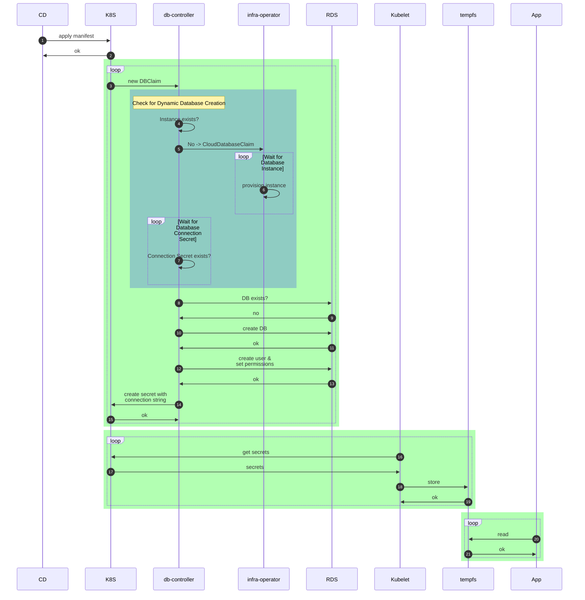
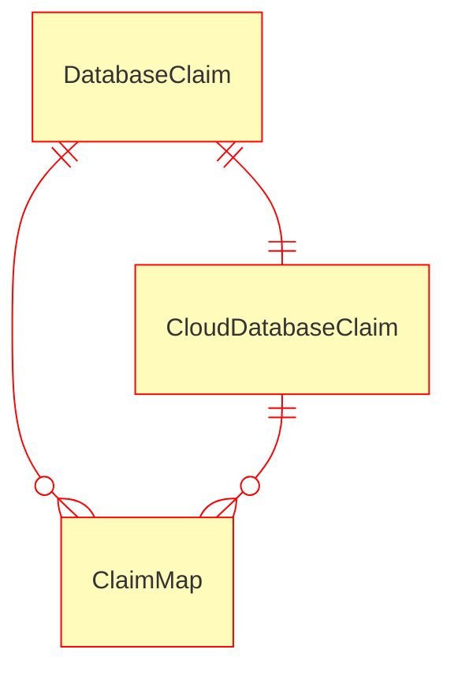
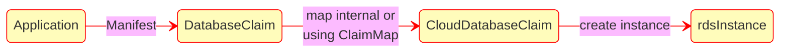
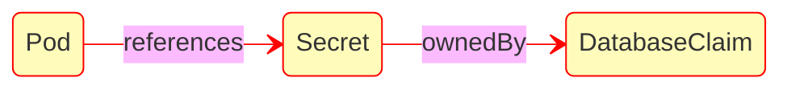
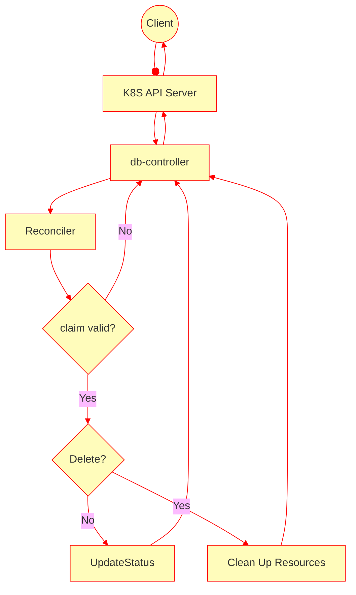
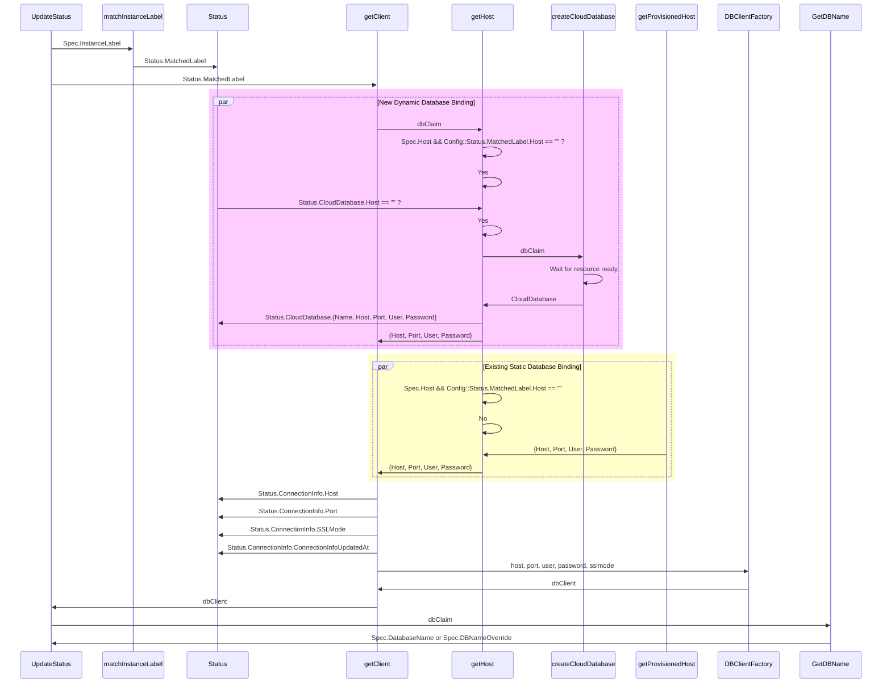
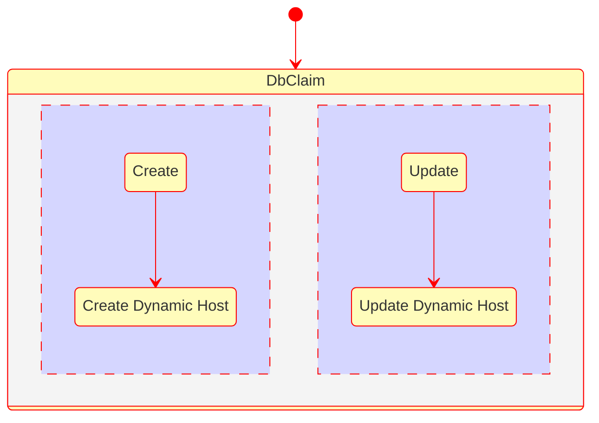

# Database Controller Docs

## Introduction
The motiviation for this project was to support dynamic creation of database resource
and minimal downtime of services during password rotation or DB instance migration.

This project implements a database controller. It introduces a CRD that allows
clients to create a database claim. That database claim will create a database in
an existing postgres server, or it could create a cloud claim that will attach a
database on demand. Additionally it will create user/password to the database and rotate them.
The database controller will also be used as a proxy driver for connecting to databases.

## Assumptions
***TBD***

## Operation
The Dynamic Database Connection Reconfiguration (DDCR) will consist of three 
components that will comprise the database claim pattern implemented by this project.  
The first will be a db-controller that is responsible for managing the connection 
information and associated database.  An application will create its intention 
to have a database by adding a  DatabaseClaim Custom Resource (DBClaim).
The second is a change to the service deployment that defines a Database Claim. 
This claim will provision a k8s secret that replaces the static credentials
created by deployment or dynamically retrieved from secret stores by
operators like [SpaceController](https://github.com/seizadi/space-controller).   
The third is a database driver that will be able to read the database connection
information from the secrets files in the pod volume and construct the 
connection string required for connecting through the real database driver.
The driver will also be able to detect when the connection information 
has changed and gracefully close any open database connections.  
The closing of the connections will effectively drain the connection 
pool as well as trigger a reconnect with the new connection string
information by the client service.

## Requirements
| Requirements           | Description                                                                                   |
|------------------------|-----------------------------------------------------------------------------------------------|
| DDCR                   | Establish a pattern (and possible code) for apps to reload connection information from a file |
| DDCR                   | Establish a pattern for mounting a secret that contains connection information in a secret    |
| DDCR                   | Support dynamically changing the connection information                                       |
| DDCR                   | Support labels for sharing of dynamically created databases                                   |
| DDCR                   | Modify at least one Atlas app to show as an example of implementing this pattern              |
| Cloud Provider Tagging | Cloud Resource must be tagged so that then can following organization guidelines.             |
| DB Instance Migration  | CR Change create new database instance and migrate data and delete infrastructure CR          |
| DB Instance Migration  | Migration should with Canary pattern once tests pass all traffic to the new database          |

## Service Architecture
The first component is a db-controller service that will be responsible 
for reading DBClaims and then provisioning the database and user(s) 
for that database. The service will also publish this information 
into kubernetes secrets, so they can propagate to the other components.  
The db-controller is also responsible for rotating the user password 
based on the password related config values, and updating the user 
password in the associated database and kubernetes secrets store.

The db-controller will support config values and master 
DB instance connection information, defined in a configMap, 
as well as the references to the kubernetes basic auth secrets 
that contain the root password for each database instance.
At startup of the db-controller, the db-controller will scan 
any existing DBClaims in its datastore and use the ConnectionInfoUpdatedAt 
timestamp as the starting point for the passwordRotation timers.

The second component is to modify the pod definition of the application 
service to support secrets in files.  In this model, each key within 
the secret will be mapped into a separate file in the mountPath of the volume

The third component is a database proxy package for the application service. This proxy 
will be used in place of the existing database driver. It is configured to register 
the real driver for the database type,so that it can forward all the calls to this 
driver. The proxy driver will also be configured with a strategy for where it 
can find and monitor the secrets associated with the connection string. When the 
proxy detects that any of the connection string information has changed 
it can close any open connections that the application has with the real database 
driver. When the proxy closes the connections, it will trigger the connection 
pool to flush any bad connections, and allow the client application to reconnect. The 
new database connections for the application will then transparently use the 
new connection string information provided by the proxy.



## Data Model
The database proxy will include a DatabaseClaim Custom Resource. In the first
version of the application the DatabaseClaim contained information related 
to a specific instance of a database. In the next major release the DatabaseClaim
has information to help an infrastructure operator select a database for the
client application. This pattern will allow us to make the database selection be
pre-provisioned or dynamic on demand. It will also allow the database selction to
be multi-cloud e.g. AWS or Azure.

DatabaseClaim will 
include properties such as the name, appID, Type, etc. During startup, 
the db-controller will read the set of CR’s describing the DatabaseClaim and store 
them in-memory. In the case of dynamic database provisioning
a CR is created to request infrastructure operator to create the database instance.
db-controller will check the CR satus and to make sure that the database is provisioned
and information about it is available in a secret refrenced by the CR.

The db-controller will listen for any changes to the DatabaseClaim CR’s and 
remain in-sync with the K8 definitions. In the case of dynamic database provisioning
a change will cause a new infrastructure CR to be created, when the new database
instance is created we should migrate all password, data and connection to it and delete
the old infrastructure CR. It will be infrastructure operator concern if the cloud
database instances are deleted immediately or there is a higher level operations
workflow to reclaim them. We can break the database migration into phases and deliver
just new infrastructure CR on change, this might be fine for development environments
and work on the full feature for production. There are also advanced use case like 
canary where where an new release of the application creates the new database, tests
the migration and once everything is working all traffic is migrated away from the
old database and it can be reclaimed.

The following shows the mapping of the DatabaseClaim to a CloudDatabase.
The CloudDatabaseClaim could be custom or use a infrastructure provider like
[crossplane resource composition](https://github.com/crossplane/crossplane/blob/master/design/design-doc-composition.md#resource-composition).
The DatabaseClaim could also be mapped to a Cloud provider like
[AWS ACK](https://github.com/aws-controllers-k8s/community), providing multi-cloud support by transforming
DatabaseClaim to a specific cloud provider CR.
In the case of AWS you would leverage
[ACK RDS Provider](https://github.com/aws-controllers-k8s/rds-controller).

The ClaimMap is meant to transform between DatabaseClaim and CloudDatabaseClaim.
We will not use a resource for the ClaimMap, but will use a naming convention to do the
mapping and will use the existing FragmentKey for the map to group a number of
DatabaseClaim to share a database instance. If more complex use cases arrive we
could implement a resource to provide the mapping.



This the deploying with the CR scheme:
**Relationship of a DatabaseClaim to a Secret and a Pod:**

Here is an example of what the CloudDatabaseClaim would look like if we used
Crossplane. The compositionRef maps our CloudDatabaseClaim to a cloud specific 
database instance defintion that is managed by Crossplane:
```yaml
apiVersion: database.infobloxopen.github.com/v1alpha1
kind: CloudDatabaseClaim
metadata:
  name: db-controller-cloud-claim-database-some-app
  namespace: db-controller-namespace
spec:
  parameters:
    type: postgres
    minStorage: 20GB
  compositionRef:
    name: cloud.database.infobloxopen.github.com
  writeConnectionSecretToRef:
    name: db-controller-postgres-con-some-app
```

In this example db-controller-postgres-con-some-app Secret that is written by the
infrastructure operator has the connection string and password information for the 
db-controller to manage the instance, similar to the pre-provisioned use case.

### ConfigMap
The db-controller will consume a configMap that contains global config values.
```yaml
apiVersion: v1
kind: ConfigMap
metadata:
  name: db-controller-config
  namespace: db-controller-namespace
data:
  config.yaml: |
    passwordConfig:
      passwordComplexity: enabled
      minPasswordLength: "15"
      passwordRotationPeriod: "60"
    atlas:
      username: root
      host: some.service
      port: 5432
      sslMode: disable
      passwordSecretRef: atlas-master-password
      passwordSecretKey: password
    atlas.recyclebin:
      username: root
      host: some.other.service
      port: 5412
      sslMode: disable
      passwordSecretRef: atlas-recyclebin-password
    athena:
      username=root
      host=some.service
      port=5432
      sslMode: disable
      passwordSecretRef=athena-master-password
    athena.hostapp:
      username=root
      host=some.service
      port=5432
      sslMode: require
      passwordSecretRef=athena-hostapp-password
```

* authSource: Determines how database host master password is retrieved. The possible values are "secret" and "aws". In the case of "secret" the value from the passwordSecretRef Secret is used for the password. In the case of "aws" the RDS password is retrieved using AWS APIs and db-controller should have IAM credentials to make the necessary calls.
* region: The region where dynamic database is allocated
* passwordComplexity: Determines if the password adheres to password complexity rules or not.  Values can be enabled or disable.  When enabled, would require the password to meet specific guidelines for password complexity.  The default value is enabled.  Please see the 3rd party section for a sample package that could be used for this.
* minPasswordLength: Ensures that the generated password is at least this length.  The value is in the range [15, 99].  The default value is 15.  Upper limit is Postgresql max password length limit.
* passwordRotationPeriod: Defines the period of time (in minutes) before a password is rotated.  The value can be in the range [60, 1440] minutes.  The default value is 60 minutes.

* Fragment Keys: This is the label to use for identifying the master connection information to a DB instance
   - Username: The username for the master/root user of the database instance
   - Host: The host name where the database instance is located
   - Port: The port to use for connecting to the host
   - sslMode: Indicates of the connection to the DB instance requires secure connection values "require" or "disable"
   - passwordSecretRef: The name of the secret that contains the password for this connection
   - passwordSecretKey: Optional value for the key value, default value is "password"
   - shape: The optional value of shape, see DatabaseClaim, specified here when defined by FragmentKey
   - minStorageGB: The optional value of minStorageGB, see DatabaseClaim, specified here when defined by FragmentKey
   - engineVersion: The optional version of RDS instance, for now Postgres version, but could be other types
   - deletePolicy: The optional DeletePolicy value for CloudDatabase, default delete, possible values: delete, orphan
   - reclaimPolicy: Used as value for ReclaimPolicy for CloudDatabase, possible values are "delete" and "retain"

* defaultMasterPort: Value of MasterPort if not specified in FragmentKey
* defaultMasterUsername: Value of MasterUsername if not specified in FragmentKey
* defaultSslMode: Value of sslMode if not specified in FragmentKey
* defaultShape: Value of Shape if not specified in FragmentKey or DatabaseClaim
* defaultMinStorageGB: Value of MinStorageGB if not specified in FragmentKey or DatabaseClaim 
* defaultEngineVersion: Value of EngineVersion if not specified in FragmentKey or DatabaseClaim
* defaultDeletionPolicy: The DeletionPolicy for CloudDatabase, possible values: delete, orphan
* defaultReclaimPolicy: Used as default value for ReclaimPolicy for CloudDatabase, possible values are "delete" and "retain"

The configMap and credential secrets must be mounted to volumes within the 
pod for the db-controller.  This ensures that when the keys are updated, the 
projected keys will also be updated in the pod volume. Below is a sample
Pod spec with secret and volumes configured:
```yaml
apiVersion: v1
kind: Pod
metadata:
  name: db-controller
spec:
  containers:
    - name: db-controller
      image: infobloxopen/db-controller-abcdefg123
      command: [ "/main" ]
      volumeMounts:
      - name: config-volume
        mountPath: /etc/config
      - name: root-user
        mountPath: "/etc/credentials"
        readOnly: true
  volumes:
    - name: config-volume
      configMap:
        name: db-controller-config
    - name: athena-root-user
      secret:
        secretName: athena-hostapp-password
  restartPolicy: Never
```
The root user passwords will be stored in kubernetes secrets and the name 
must match the passwordSecretRef value in the configMap. Here is sample Secret
that match above example:
```yaml
apiVersion: v1
kind: Secret
metadata:
  name: athena-hostapp-password
type: Opaque
stringData:
  password: t0p-Secr3t!@
```

### DatabaseClaim Custom Resource
The DatabaseClaim custom resource describes the connection information for 
a database instance.  It includes the following properties:

DatabaseClaim:

   * spec:
      - AppID: Application ID used for the application.
      - SecretName: The name of the secret to use for storing the ConnectionInfo.  Must follow a naming convention that ensures it is unique.  The SecretName is Namespace scoped.
      - Type: The type of the database instance. E.g. Postgres
      - InstanceLabel: The matching fragment key name of the database instance that will host the database. The fragment keys are defined in the db-controller configMap and describe the connection information for the database instance that this DBClaim is associated with. The longest match will win. For example, the database claim can have a label of athena.hostapp but the only available RDS instances have a label of athena, atlas and northstar. So the controller would match the athena instance. If however an instance label has a label of athena.hostapp, then the hostapp claim would match it exactly.
      - Username: The username that the application will use for accessing the database.
      - DatabaseName: The name of the database instance. 
      - DBNameOverride: In most cases the AppID will match the database name. In some cases, however, we will need to provide an optional override.
      - DSNName: The key used for the client dsn connection string in the Secret
      - Host: The optional host name where the database instance is located.  If the value is omitted, then the host value from the matching InstanceLabel will be used.
      - Port: The optional port to use for connecting to the host.  If the value is omitted, then the host value from the matching InstanceLabel will be used.
      - Shape: The optional Shape values are arbitrary and help drive instance selection
      - MinStorageGB: The optional MinStorageGB value requests the minimum database host storage capacity
      - DeletePolicy: The optional DeletePolicy value defines policy, default delete, possible values: delete, recycle

   * status:
      - Error: Any errors related to provisioning this claim.
      - DbCreatedAt: Time the database was created.
      - ConnectionInfoUpdatedAt: Time the connection info was updated/created.
      - MatchedLabel: The name of the label that was successfully matched against the fragment key names in the db-controller configMap
      - ConnectionInfo[] (data in connection info is projected into a secret)
         - Username: The username that the application will use for accessing the database. 
         - Password: The password associated with the Username.
         - Host: The host name where the database instance is located.
         - Port: The port to use for connecting to the host.
         - DatabaseName: The name of the database instance.
         - UserUpdatedAt: Time that this user connection information was last updated

## Secrets
During the processing of each DatabaseClaim, the db-controller will generate the 
connection info and also create a secret with the relevant information. The secret 
will have the same name as the DatabaseClaim, and contain keys that match the 
values of the properties under the DatabaseClaim *status.connectionInfo* property.


### Using Secrets as Files
Modify the Pod definition, for the service that you will add the proxy package, to 
add a volume under *.spec.volumes[]*. Name the volume anything, and have 
a *.spec.volumes[].secret.secretName* field equal to the name of the Secret 
object, which in this case is also the name of the DatabaseClaim.

Add a *.spec.containers[].volumeMounts[]* to each container that needs 
the secret. Specify *.spec.containers[].volumeMounts[].readOnly = true* 
and *.spec.containers[].volumeMounts[].mountPath* to an unused directory 
name where you would like the secrets to appear.

Modify your image or command line so that the proxy package looks 
for files in that directory. Each key in the secret data map becomes the 
filename under mountPath.

### Example Secret Config
```yaml
apiVersion: v1
kind: Pod
metadata:
  name: mypod
spec:
  containers:
  - name: mypod
    image: redis
    volumeMounts:
    - name: foo
      mountPath: "/etc/connection"
      readOnly: true
  volumes:
  - name: foo
    secret:
      secretName: mysecret
```

**Relationship of a DatabaseClaim to a Secret and a Pod:**


## API
***N/A***

## Implementation

***TODO***
***Document full implementation for now focused on claim pattern updates***

This implementation will use the 
[kubebuilder](https://book.kubebuilder.io/introduction.html) pattern
for implementation of the db-controller. This implementation starts
with building a project:
```bash
kubebuilder init --domain atlas.infoblox.com --repo github.com/infobloxopen/db-controller
```
This project was layed down by kubebuilder which depend on
*sigs.k8s.io/controller-runtime* and supports an architecture
[described here](https://book.kubebuilder.io/architecture.html).
A key part of this architecture is the *Reconciler* that encapsulates
the custom logic that runs when request are forwarded from Kubernetes
API Server to this controller. Specifically it the DatabaseClaim
resources that is served.

There is a go method (class) defined for handling reconcile functions:
```go
// DatabaseClaimReconciler reconciles a DatabaseClaim object
type DatabaseClaimReconciler struct {
	client.Client
	Log        logr.Logger
	Scheme     *runtime.Scheme
	Config     *viper.Viper
	MasterAuth *rdsauth.MasterAuth
}
```
Then the reconcile functions that are parts of the method class are
defined with this signature:
```go
func (r *DatabaseClaimReconciler) Reconcile(ctx context.Context, req ctrl.Request) (ctrl.Result, error) {...}
func (r *DatabaseClaimReconciler) updateStatus(ctx context.Context, dbClaim *persistancev1.DatabaseClaim) (ctrl.Result, error) {...}
```

The following is the high level view of the reconcile logic:


The DatabaseClaim
Status is where keep the state used by the reconciler. The two parts
of the Status that are important are:

* MatchedLabel: The name of the label that was successfully matched against the fragment key names in the db-controller configMap
* ConnectionInfo[]: connection info about the database that is projected into a client accessible secret

There is also a fragmentKey that is the same as the MatchedLabel,
but not sure there are two items versus one ***TBD***.

In this part we will look at the UpdateStatus function sequence and the
proposed changes to support dynamic database creation while leaving much of
the working db-controller to interoperate:



### Lifecycle
***TODO - Document the full lifecycle not just for Dynamic Host***

The dynamic host allocation will have the following lifecycle:

The create and update lifecycles are fairly simple:


The delete lifecycle is more complex shown below:


The sharing of database by multiple applicaitons (Claims) by Crossplane
[is an open issue](https://github.com/crossplane/provider-gcp/issues/157).
The db-controller creates the CloudDatabase Claim and the associated
connection secret is created in the db-controller namespace.
We can allow sharing of the database using the FragmentKey structure
by mapping to the FragmentKKey using DatabaseClaim InstanceLabel property.

[Crossplane](https://github.com/crossplane/crossplane-runtime/issues/21) started 
with the intent of using a similar
[pattern used by pv and pvc](https://kubernetes.io/docs/concepts/storage/persistent-volumes/#reclaiming)
in Kubernetes. The ReclaimPolicy had a lot off issues and it
[got backed out](https://github.com/crossplane/crossplane-runtime/issues/179) and
it got renamed to DeletionPolicy on just the CloudDatabase resource.

DatabaseClaim resources are namespaced, but the
CloudDatabase resources are dynamically provisioned as cluster scoped.
A namespaced resource cannot, by design, own a cluster scoped resource.
This could be an issue in how we manage lifecycle, see
[kubernetes](https://github.com/kubernetes/kubernetes/issues/65200) and
[crossplane](https://github.com/crossplane/provider-gcp/issues/99) references.

Given the Crossplane experience we will retain the FragmentKey allocation
CloudDatabase cluster resource so that it can be shared. The deletion of
ClaimDatabase will remove the CloudDatabase directly allocated
directly by its claim, similar behavior to Crossplane composite behavior 

We need some more research PoC to figure out if
we can use 
[Kubernetes Finalizers](https://kubernetes.io/docs/concepts/overview/working-with-objects/finalizers/)
on DatabaseClaim to honor a ReclaimPolicy with values of delete and retain.
Then have ReclaimPolicy delete a dynamically allocated database
that is no longer shared. The reason for the 
[deprecation of ReclaimPolicy from CrossPlane](https://github.com/crossplane/crossplane-runtime/issues/179#issuecomment-637462056)
needs to be examined in the light of our requirements and why Crossplane
does not offer a 
[Shared Database Pattern](https://github.com/crossplane/provider-gcp/issues/157).
A argument made [here](https://github.com/crossplane/crossplane/issues/1229#issuecomment-585382715) 
suggest that in most cases sharing infrastructure within namespace 
boundaries with a  single claim is valid, as namespace == application 
team boundary. Does forcing applciations to share namespace for
database sharing cause any issues, e.g. RBAC?

The initial PoC will manage ReclaimPolicy from the db-controller
configuration using the InstanceLabels that enable sharing.
There will be a DatabaseClaim finalizer that will run 
and if there are no more claims against the InstanceLabel
then the dynamic database is reclaimed. There will also
be a global and reclaim policy per InstanceLabel/FragmentKey.
This will not be exposed to the Applications e.g. ReclaimPolicy 
in the DatabaseClaim. I don't think we need this complexity
but could be added if there is a need.

The Crossplane Infrastructure Operator, has a
resource DeletionPolicy which specifies what will happen 
to the underlying external cloud resource when this managed resource is 
deleted - either "Delete" or "Orphan" the external resource. This will
be managed by defaultDeletionPolicy and deletionPolicy on each FragmentKey.

Another features we have is to share resources like RDS among
different clusters that are deployed. We don't have a design yet on
how to best support this requirement.
Crossplane Infrastructure Operator supports multiple clusters,
using an admin cluster and then resources like CloudDatabases
are pushed to the managed clusters,
[Crossplane workload reference](https://blog.crossplane.io/crossplane-v0-7-schedule-workloads-to-any-kubernetes-cluster-including-bare-metal/).
Crossplane also have an [observerable pattern](https://github.com/crossplane/provider-gcp/issues/157)
to deal with this coupling between clusters trying to share resources.

### Deployment
When API is updated need to update the crd definition
and helm chart that updates it. The following make target
is setup to do this:
```bash
make update_crds
```
### Authentication
### Authorization
This db-controller service will require access to credentials that have
permissions to provision the database as well as access to the master
user account to manage users for the target database.

### Ingress
***N/A***

### Audit
***N/A***

### Logging
***TBD***

### Alerting
Prometheus alerts based on errors from the db-controller.

### Performance
***N/A***

### Security
***TBD***

### Third-Party Software
| Name/Version | License      | Description/Reason for usage                                                         |
|--------------|--------------|--------------------------------------------------------------------------------------|
| fsnotify     | BSD-3-Clause | Golang cross platform file system notifications                                      |
| go-password  | MIT License  | Generation of random passwords with provided requirements as described by  AgileBits |

### Metrics/Telemetry
* The following metrics should be exposed:
* Total database users created
* Time to create a new database user
* Total database provisioning errors
* Total database users created with errors
* Total passwords rotated
* Time to rotate user password
* Total password rotated with error
* Total DBClaim load errors
* Total DBClaims loaded
* Time to load a DBClaim

### Rate Limits
***N/A***

### UX/UI
***N/A***

### High Availability/Resiliency
***TBD***

### Scalability
The db-controller service needs to be able to scale out based on demand.

### Backup
***N/A***

### Disaster Recovery
***TBD***

### Data Retention
***N/A***

## Testing
### Test Plan
***TBD***

### Test Matrix
***TBD***

## Migration
***N/A***

## Deployment Architecture
***TBD***

## Upgrades
***N/A***

## Service Dependencies

This service depends on these services:
* kube-api-server
* [SpaceController](https://github.com/seizadi/space-controller) or similar operator: updates the RDS root passwords that the db-controller can use

These services depend on this service:
***N/A***

## Service Killers

| Service Name   | Impact                                                                        |
|----------------|-------------------------------------------------------------------------------|
| RDS            | Can't create new databases, can't rotate passwords. can't process new claims. |
| kube-apiserver | full down.                                                                    |

## Data Analytics
***N/A***

## References
[Hotload database driver](https://github.com/infobloxopen/hotload)


